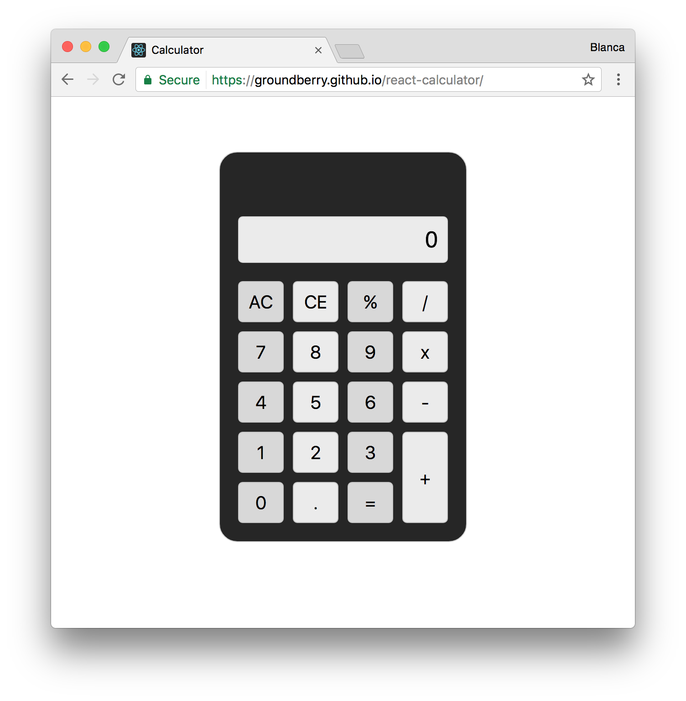
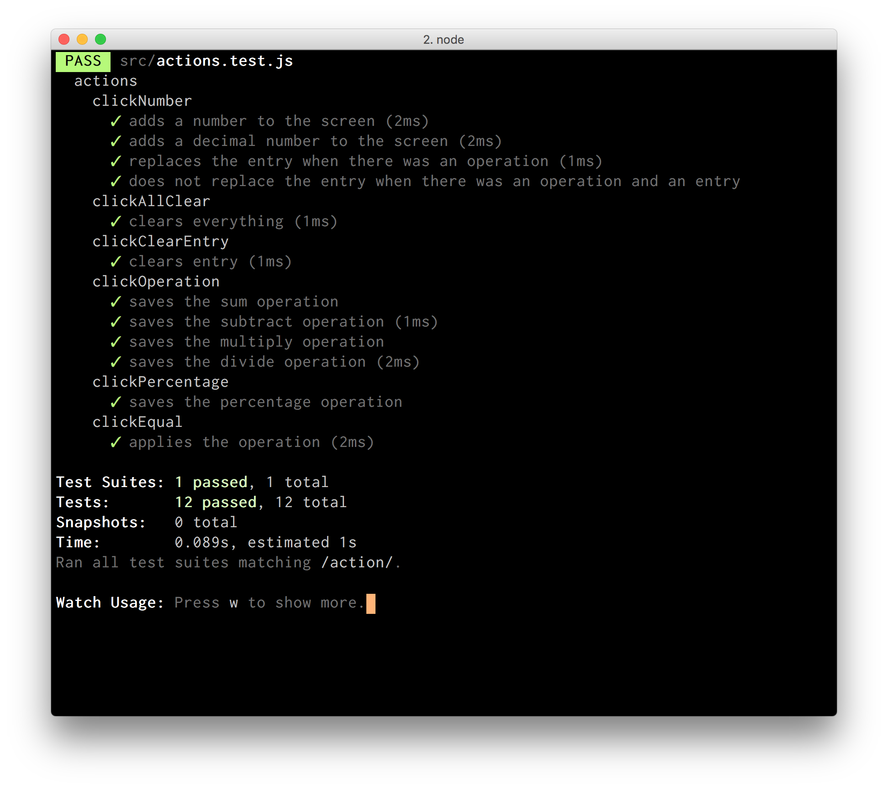

# Calculator

This project is part of the Free Code Camp's front-end track. I'll build a calculator using [React](https://facebook.github.io/react/).

## Functionality

- I can add, subtract, multiply and divide two numbers.
- I can clear the input field with a clear button.
- I can keep chaining mathematical operations together until I hit the equal button, and the calculator will tell me the correct output.



## Technologies used

The client side of the app is built with [React](https://facebook.github.io/react/). I used [Create React App](https://github.com/facebookincubator/create-react-app) to get it started. For the styling of the UI I used [CSS Grid Layout](https://developer.mozilla.org/en-US/docs/Web/CSS/CSS_Grid_Layout).

For testing I used [Jest](https://github.com/facebook/jest).

## Challenges

*Learning CSS Grid Layout* - CSS Grid is a new technology that seemed really well suited to this UI. I had to learn it from scratch.

*Separate actions that modify state from UI* - TDD helped keep complexity under control when implementing each mathematical operation and their edge cases.

## Running

Clone this repo:

```
$ git clone https://github.com/groundberry/react-calculator
```

Install all dependancies:

```
$ npm install
```

Start the server:

```
$ npm start
```

## Testing

Run the tests:

```
$ npm run test
```


